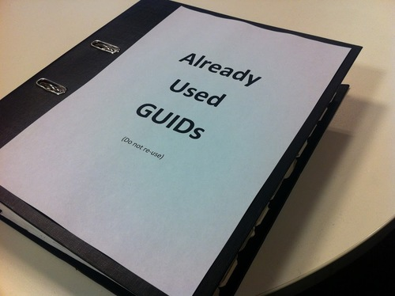
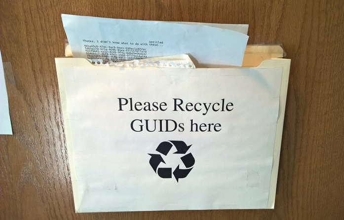
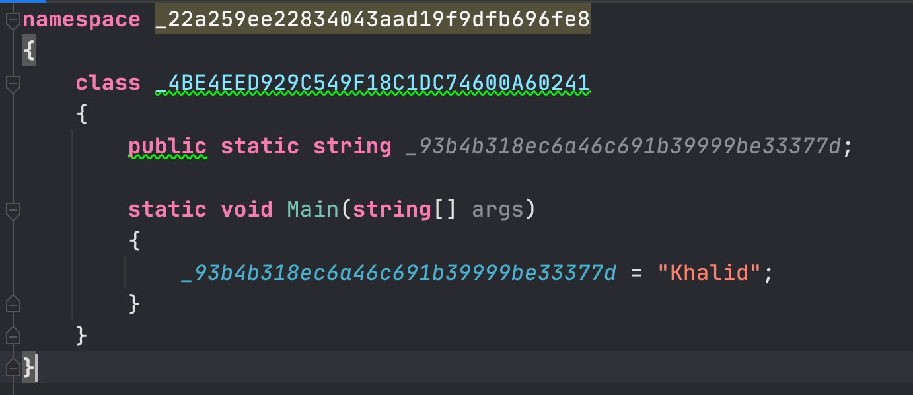

# AwesomeGUID

A list of awesome things related to Globally Unique Identifiers. Sorry if this whole idea is a bit mis-guid-ed.

## Tools

- [Guid Generator](https://www.guidgenerator.com/)
- [Hot Guids](http://www.secretgeek.net/hotGuids/index.htm): The Social Network for GUIDs, "Is this Guid HOT or NOT?"
- [Guess a Guid](http://guessaguid.secretgeek.net): The fun guid-guessing game.
- [Cute uid](https://github.com/alexdredmon/cuteuid): Generate Cute UIDs 

## Used Guids **MUST** Be Added To This Folder

## Recycling and Upcycling

Instead of single use guids, consider donating them for reliable reuse by an approved, accredited and reputable GUID recycler.

## Frequently Asked Questions

### What are the chances of collision?

If every human on Earth worked as a GUID generator, and they spent their entire working life generating guids at one guid per second, without even stopping for lunch, then by the time every human on earth had retired, the chances of a collision would be about 50%.

### Do guids make the best database identifiers?

Yes. But I don't use them much for that myself.

### Should you put GUIDs in URLs?

No. [Don't Put Guids in URLs](http://wiki.c2.com/?DontPutGuidsInUrls)

And if you do, **1 is enough!**

### Can I register a domain named after a specific guid value?

Yes you certainly can, but hurry as they are going fast.

For example, this one is already taken:

[http://00000000-0000-0000-0000-000000000000.com](http://00000000-0000-0000-0000-000000000000.com/)

And certainly <http://00000000-0000-0000-0000-000000000001.com> is parked.

But as of September 2020, http://00000000-0000-0000-0000-000000000002.com is still available.

**Get in on it while you can.**

*There will never be another opportunity like this.*

## Explanations

- [The Quick Guide to GUIDs](https://betterexplained.com/articles/the-quick-guide-to-guids/)
- [Wikipedia: Universally Unique Identifier](https://en.wikipedia.org/wiki/Universally_unique_identifier)

## Pronunciation Guide

- Goo-id or gwid. You decide. 

## Global GUID database

- [GLOBAL UUID DATABASE](https://uuid.pirate-server.com) &mdash; World's most complete UUID database.

## Behold

Some beautiful code from [@buhakmeh](https://twitter.com/buhakmeh/status/1301517508000854022)

## Twitter Accounts for Lovers of the Guid

- [@usedguid](https://twitter.com/usedguid): 100% guids 100% of the time.
- [@everyguid](https://twitter.com/everyguid): tweeting every globally unique identifier. 
- [@guids4druids](https://twitter.com/guids4druids): tweeting guids for druids

